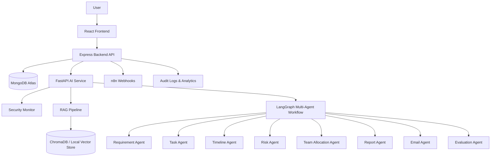

# Architecture Diagram

## Data Flow

1. User uploads requirements or pastes text.
2. Backend validates input and forwards content to AI service.
3. AI service masks sensitive data and checks prompt injection.
4. RAG pipeline chunks and retrieves relevant context.
5. Multi-agent workflow generates project plan.
6. Backend stores projects, tasks, risks, metrics, and audit logs.
7. Frontend displays workspace, Kanban, dashboards, reports, and emails.
