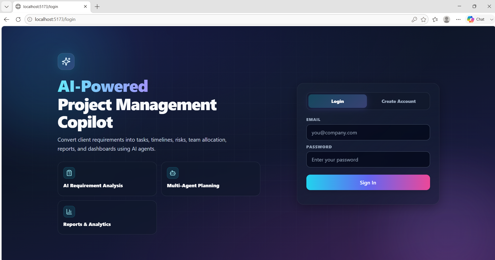
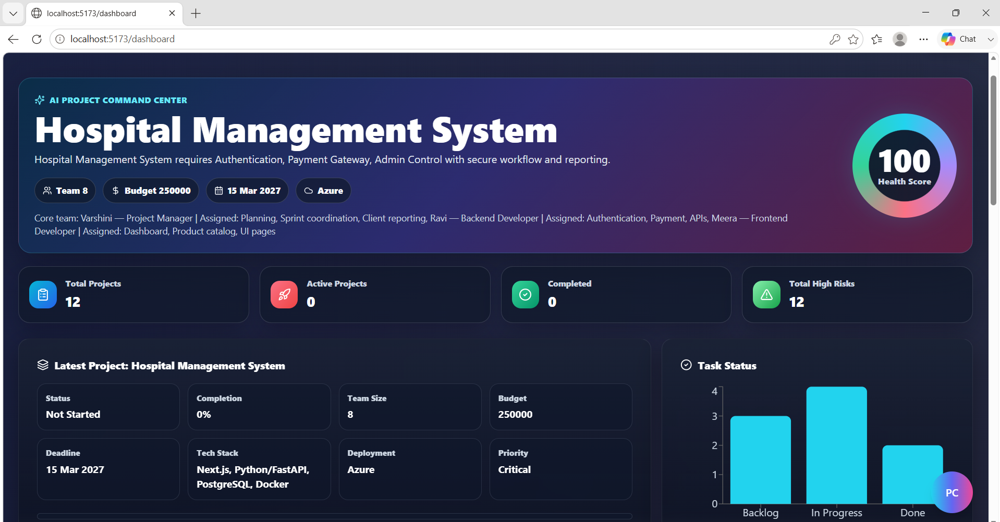
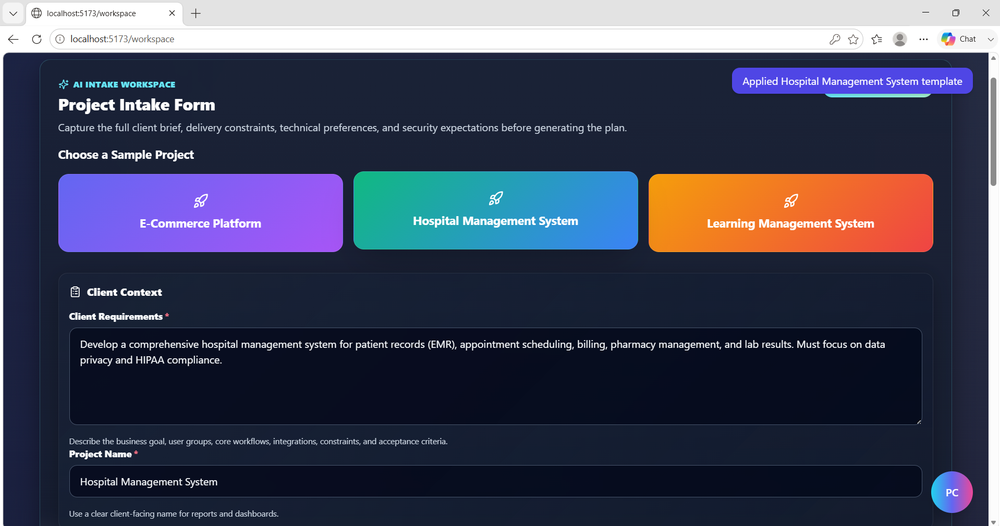
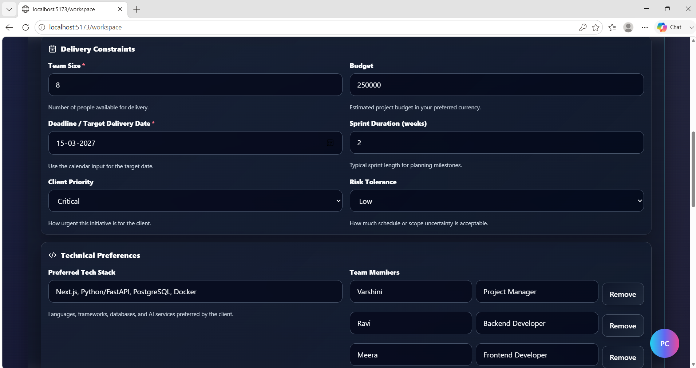
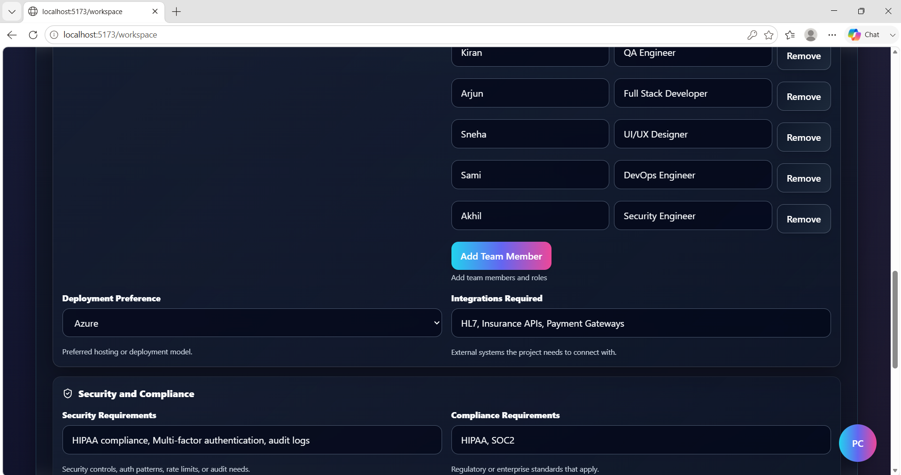
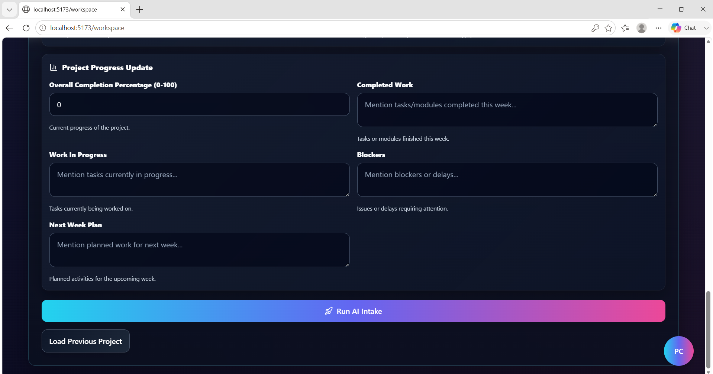
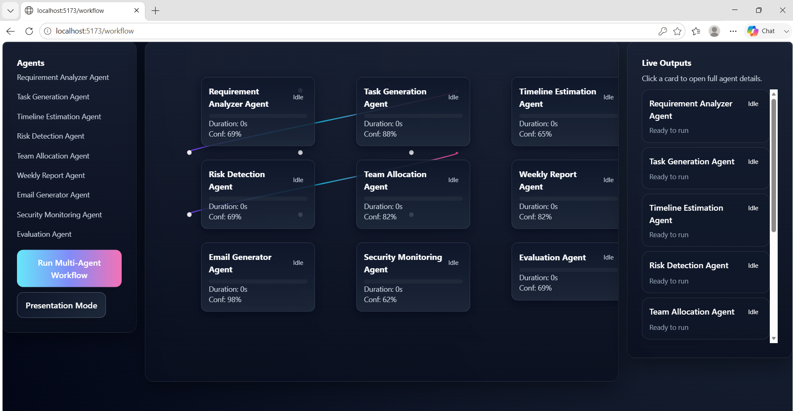
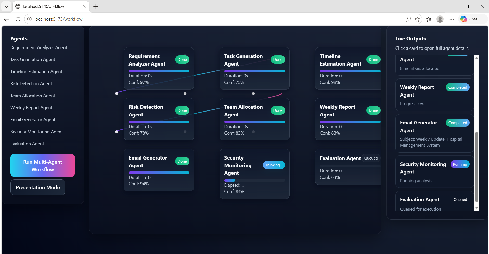
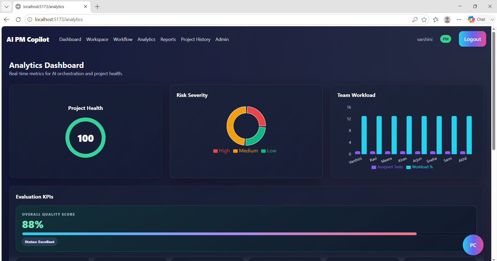
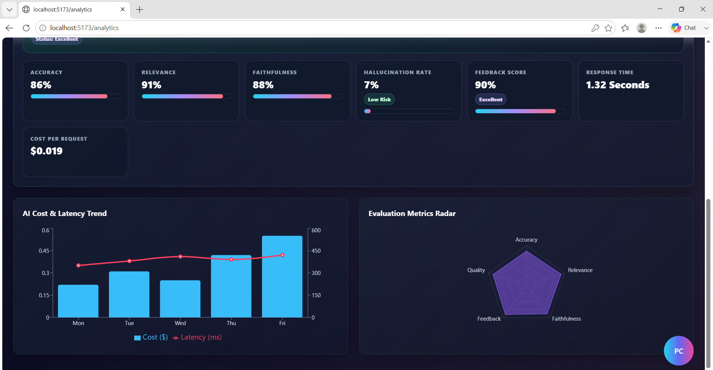

# AI-Powered Project Management Copilot

## Problem Statement

Project managers spend a lot of time manually converting client requirements into tasks, timelines, risks, reports, and team allocation. This project solves that by using AI agents to automate project planning.

## Project Title

AI-Powered Project Management Copilot

## Demo Link

YouTube Demo: https://youtu.be/WHGDY8qOkcg

## Tech Stack

Frontend:
- React.js
- Tailwind CSS
- Recharts

Backend:
- Node.js
- Express.js

AI:
- LangChain
- LangGraph
- FastAPI

Database:
- MongoDB

Deployment:
- Vercel
- Render
- Docker

## Key Features

- User login and signup
- Project intake form
- AI requirement analysis
- Multi-agent workflow
- Task generation
- Timeline milestones
- Risk analysis
- Team allocation
- Weekly report generation
- Email update generation
- Analytics dashboard
- Project history
- Project Copilot Assistant

## Project Modules

- Authentication Module
- Requirement Analysis Module
- Multi-Agent Workflow Engine
- Timeline Planner
- Risk Analyzer
- Team Allocation Engine
- Weekly Report Generator
- Email Generator
- Analytics Dashboard
- Project History Management
- Project Copilot Assistant

## Repository Structure

frontend/      → React Frontend
backend/       → Express Backend
ai-services/   → AI Services & Agents
docs/          → Project Documentation
workflows/     → Agent Workflows
vector-db/     → Vector Database Storage
docker/        → Containerization Files
deployment/    → Deployment Configurations

## Architecture Design

Client Requirements
→ React Frontend
→ Node.js Backend
→ Multi-Agent AI Engine
→ Tasks / Risks / Reports
→ MongoDB Database
→ Dashboard & Analytics
## How It Works

1. User logs in.
2. User fills project intake form.
3. AI analyzes requirements.
4. Agents generate tasks, risks, milestones, team allocation, reports, and email updates.
5. Dashboard and analytics display project insights.
6. Project history stores previous projects.

## Environment Variables

### Backend (.env)

```env
PORT=5000
CLIENT_URL=http://localhost:5173
MONGODB_URI=mongodb://localhost:27017/pm_copilot
JWT_SECRET=your_jwt_secret
AI_SERVICE_URL=http://localhost:8000
N8N_WEBHOOK_URL=http://localhost:5678/webhook/project-copilot
```

## Installation Steps

### Clone Repository

git clone https://github.com/23eg105t10-crypto/AI-Powered-Project-Management-Copilot.git
cd AI-Powered-Project-Management-Copilot


### Run Backend

cd backend
npm install
npm run dev


### Run AI Service

cd ../ai-services
source venv/Scripts/activate
uvicorn main:app --reload --port 8000

### Run Frontend

cd ../frontend
npm install
npm run dev

Open:

http://localhost:5173

---

## Evaluation

The system evaluates project planning quality using:

* Accuracy
* Relevance
* Faithfulness
* Hallucination Rate
* Latency
* Cost Per Request
* Feedback Score

---

## Challenges Overcome

* Building a multi-agent workflow system
* Generating timelines automatically from requirements
* Dynamic team allocation
* Risk identification and mitigation planning
* Weekly report generation
* Dashboard analytics visualization
* Project history management
* UI/UX optimization
* Frontend and backend integration

---

## Screenshots

### Login Page



### Dashboard



### Workspace






### Workflow




### Analytics




---

## Future Improvements

* Jira Integration
* Slack Integration
* Real-time Team Collaboration
* Advanced AI Forecasting
* Automated Sprint Planning
* PDF/DOCX Report Export
* Cloud-native Deployment
* Live Notifications
* Resource Utilization Prediction

---

## Author Information

**Name:** B. Varshini

**Roll Number:** 23EG105T10

**Project:** AI-Powered Project Management Copilot

**GitHub Repository:**
https://github.com/23eg105t10-crypto/AI-Powered-Project-Management-Copilot

**Demo Video:**
https://youtu.be/WHGDY8qOkcg
